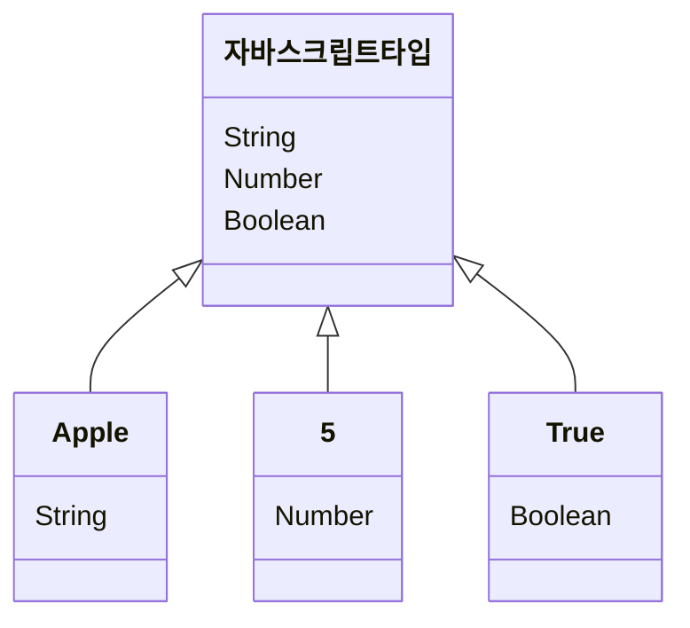
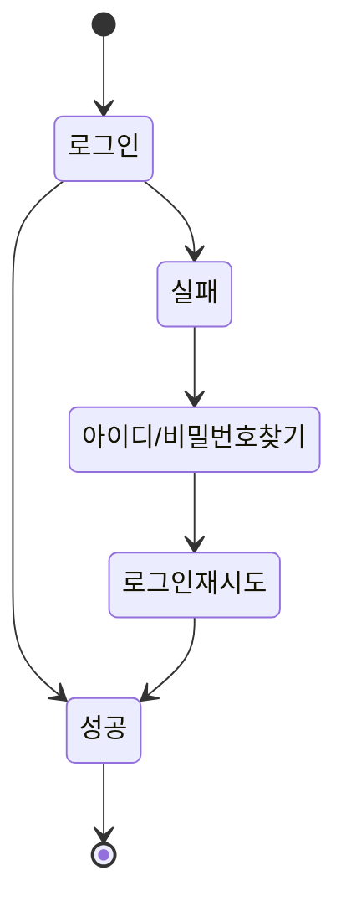
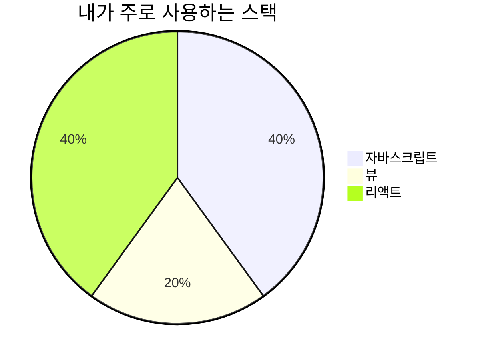
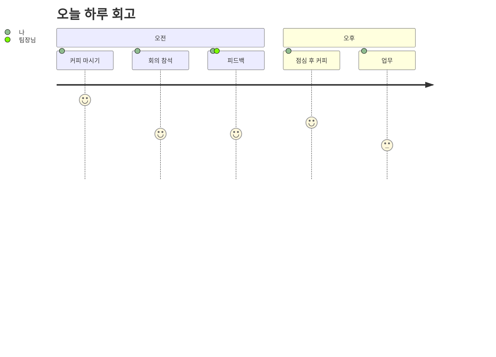

# test

```mermaid
		classDiagram
	    자바스크립트 타입 <|-- Apple
	    자바스크립트 타입 <|-- 5
	    자바스크립트 타입 <|-- True
	    자바스크립트 타입 : String 
	    자바스크립트 타입 : Number
	    자바스크립트 타입: Boolean
	    class Apple{
	      String
	    }
	    class 5{
	      Number
	    }
	    class True{
	      Boolean
	    }
```

```mermaid
		stateDiagram-v2
	    [*] --> 로그인
	    로그인 --> 성공
	    로그인 --> 실패
	    실패 --> 아이디/비밀번호찾기
	    아이디/비밀번호찾기 --> 로그인재시도
	    로그인재시도 --> 성공
	    성공 --> [*]
```

```mermaid
		gantt
	    title 하루 일과
	    dateFormat  HH-MM
	    axisFormat %H:%M
	    하루시작 : milestone, m1, 17:49,2min
	    할일1 : 60min
	    할일2 : 30min
```

```mermaid
		pie title 내가 주로 사용하는 스택
	    "자바스크립트" : 40
	    "뷰" : 20
	    "리액트" : 40
```

```mermaid
		journey 
	    title 오늘 하루 회고
	    section 오전
	      커피 마시기: 7: 나
	      회의 참석: 4: 나
	      피드백: 4: 나, 팀장님
	    section 오후
	      점심 후 커피: 5: 나
	      업무: 3: 나
```
